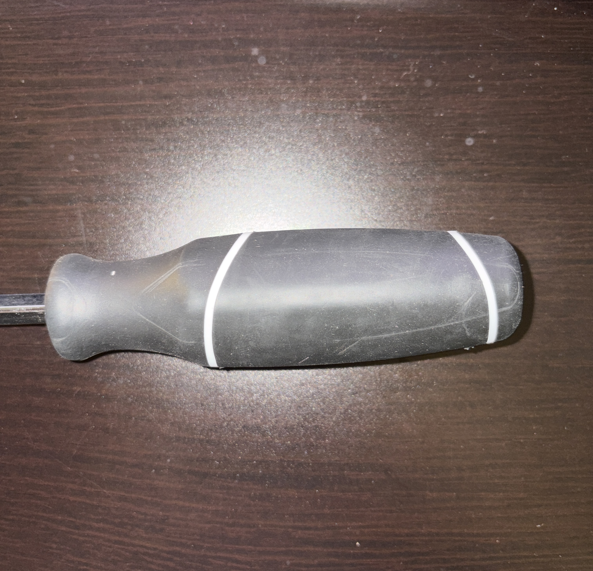
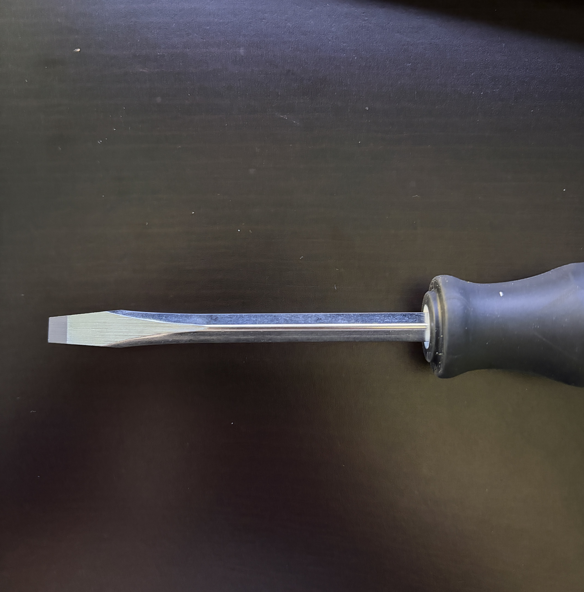
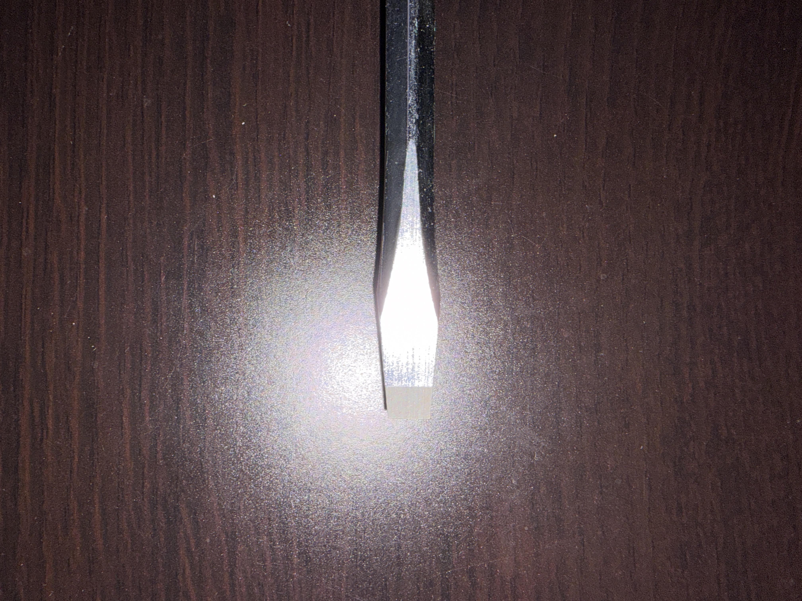
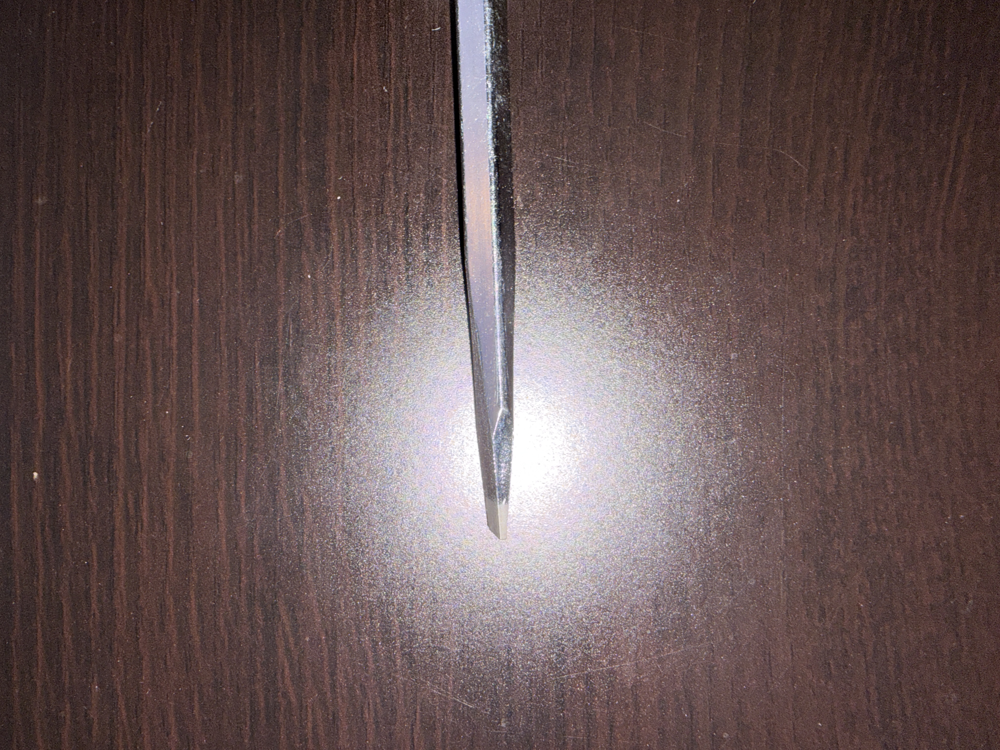

# A1 – [Building a Professional Portfolio]

## Objective
To Build a Professional Portfolio 

## Analyze

Task A Portfolio Analysis 
1. Seth Schaffer https://sites.google.com/view/sethschafferportfolio/home

**Navigability** - After viewing Seth Schaffer's portfolio on his Google Site, one can conclude that everything is laid out in an orderly fashion. The site opens up with an introduction about Seth and then is followed by media links about his combat robots. There are other pages that one can visit as well depending on what they want to know about Seth, some of which are: About me, Combat robots, Other projects and much more. After visiting this page, I can conclude that any reader will be able to locate any specific assignment or piece of work in under 60 seconds.

**Reproducibility** - No, the website does not contain the required amount of documentation that one would need to be able to reproduce his work without any concerns. Although that makes sense for Seth's case as he is using his portfolio as an advertisement page of the various robots he has built and even sells certain robot parts on his website. So for him to include documentation on how to replicate his work would be a determent to him as he is trying to sell his work and he does a good job documenting the certain parts of his robots with step by step cad photos and even videos in some cases. 

**Evidence of reasoning** - The Portfolio only shows the "chosen" outcome during the design process, although the videos give minimal insight on why certain decisions were made, the Google Site does not. He does not include any rejected ideas or even give reason as to why some ideas were preferred during the design process. His website just includes progression pictures of his design process with no insight given on why certain decisions were made. This Portfolio only shows what the final answer was.

**Professional tone** - Seth's tone is up to the standard, his Portfolio is more of an advert of his robots. The writing style and inclusion of certain words/phrases indicates a more casual tone. One particular phrase of "Again, all CAD work is by yours truly", is not off the standard. I personally would not hand this Portfolio in to an employer as it lacks standard. 

2. Nathan Hoong https://nhoong.github.io/index.html

**Navigability** - After viewing Nathan Hoong's GitHub portfolio, all the information is a scroll away. The Portfolio opens up with a brief description about Nathan
and his projects. The projects include links to a detailed pdf, which go into full details about the specific project. There are a few pages one can click on
for information and there is contact information located at the bottom of the page. In Conclusion, any reader will be able to locate any specific asignment or
piece of work in under 60 seconds.  

**Reproducibility** - Yes, there is enough documented information that one will be able to replicate his design but there is only enough information for one product.
For the "Glaukos Senior Capstone Project", there is a link provided which opens up a 38 page pdf detailing the process. Although his other projects such as the
"Butterfly valve throttle body" and "Shock top assembly", only a 3d model along with the projects objective and reasoning are provided. A reader can replicate
only his Capstone Project as that is the only one that is sufficiently documented. 
   
**Evidence of reasoning** - The 38 page pdf document relating to the Capstone Project provide data from testing results from various experiments. The data helped Nathan adjust the product accordingly. No reasoning was provided into why a certain outcome was selected for the product and no alternative methods were mentioned. The only mention was of the experiment data values and how they impacted the final product.
   
**Professional tone** - The tone and words/phrases used are up to standard. The font of the text in the "About Me" category was small, which made it hard to read. Apart from that nothing jumps out as being casual. Everything is written in a precise and descriptive manner. I would hand this document in to a potential employer as I believe the language is up to standard. 

**Product Analysis - Flat Head Screwdriver**

**A.** The Primary Function of a Flat Head Screwdriver is to assist in the loosening and tightening of fastener by applying rotational torque. The screwdriver transmits rotational torque from a user to a fastener, which in turn causes the fastener to rotate around its central axis. 

**B.** The governing equation is as follows:

τ = rFsin(θ)

**This is the torque equation.**

- **τ (Tau)** = Torque applied (N·m)

- **r** = Perpendicular distance from screwdriver's axis to line of applied force (m)

- **F** = Force applied by hand (N)

- **θ** = Angle between applied force and radius which on most cases the angle applied is θ = 90

The Screwdriver's shaft and handle are uniform rigid bodies, so there is negligible deformation in the screwdriver as torque is applied. 
This assumption assumes that the tip of the screwdriver is properly seated in its slot so torque can be applied without slipping. 

**C.**
**1. Handle**

The handle has a large cylindrical geometry that is elongated which provides a large radius so that a user's hand is able to comfortably apply force around the screwdrivers axis. The increased radius helps amplify the generated torque. The handles length provides sufficient surface area so that the user can comfortable use it. The enlarged handle diameter compared to the diameter of the shaft allows the user to generate greater torque. 

**2. Shaft**

The shaft is a long, narrow cylindrical piece of metal which connects the handle to the tip of the screwdriver. The shaft transmits rotational motion and torque along the axis. The shafts circular cross section provides torsional resistance while maintaining a small radial dimension in comparison to the handle. 

**3. Tip**

  
  

The tip is a flattened rectangular blade with a narrow width and thickness, which in turn allows it to fit in the slot of a slotted screw/bolt/fastener. The tip's thickness controls how securely it fits in a slot, while its width determines how much of the slot is engaged. The tip blade extends along the screwdrivers axis so the applied torque is transferred directly to the screw. 

**D.**

<a href="https://patents.google.com/patent/EP0512273A1/en">EP0512273A1</a>

Authors - Martin Strauch

Alternative Solutions

A Philips-Head screwdriver can complete the same task as Flat Head Screwdriver, although it ultimately depends on the hole of the fastener. As long as the hole of the fastener allows for the Philips-Head screwdriver to fit, it can accomplish the same task as the Flat Head Screwdriver. 
A Torx Screwdriver can accomplish the same task as that of a Flat Head Screwdriver, although it still would depend on the hole of the fastener. 
Both of these screwdrivers assist in transferring rotational torque from the users hand towards the fastener. The difference lies in the geometry of the interface between the tool and fastener. 

Design Decision

The patent mentions the use of two convex arcs on the tip of the screwdrivers blade. These minute convex arcs help increase the surface area between the tip and the fastener when being turned by the user, this increase in contact area leads to a higher torque being generated and spreads the force over more of the fastener. In theory this change helps increase torque while reducing slipping due to its twin convex arc design. 

## Decide

## Communicate

