# A2 – Truss Stress Analysis

## Objective
- Design a lightweight planar truss using A500 steel or an alternative material.
- Create free body diagrams (FBDs) for joints and critical pins.
- Calculate the required cross-sectional area of truss elements with a safety factor.
- Determine pin sizes based on shear forces with a safety factor.
- Solve equations *symbolically* and *numerically* for both truss and pin design.
- Estimate the total weight of the truss and pins.
- Create a CAD model with accurate dimensions and connections.
- Compare CAD weight predictions with hand calculations.
- Document key engineering lessons learned from the process.

## Analyze
- Design constraints are shown in Figure #1. (See Appendix for deeper explanation). 
- The cross sectional area of each element is to be identical.
- The pins are to be identical to each other and each element is to have the same cross-sectional geometry.

  

- Figure #1.) The force and geometric constraints of the truss design problem.
- Choose a P between 20 - 30 kN. a = .4 m, b = .3 m. Point A is a pin and point B is a roller.
## Decide
_Which geometry did you select, and why? This is your first open design choice in the course — defend it._

### Overall Truss Geometry

The first five pictures are my notes on sketching my truss, labeling the Free body Diagrams in the joints, symbolically then numerically solving for all internal forces and lastly is a table to wrap up all the data gathered so far. For this project one of the objectives were to design a lightweight planar truss, so after some thought I decided upon my idea. It is a basic truss connecting all the joints but it has a slanted beam connecting joint B to joint D, the reason I chose this is because one beam connecting B to D would be lighter and less complicated to manufacture instead of using two beams at C and D to connect to the one point in the middle of beam BA. Those 2 extra beams would add more weight and cost more to manufacture, one beam instead is lighter to use and being lightweight is one of our main objectives. My selected p value was 25 kN.

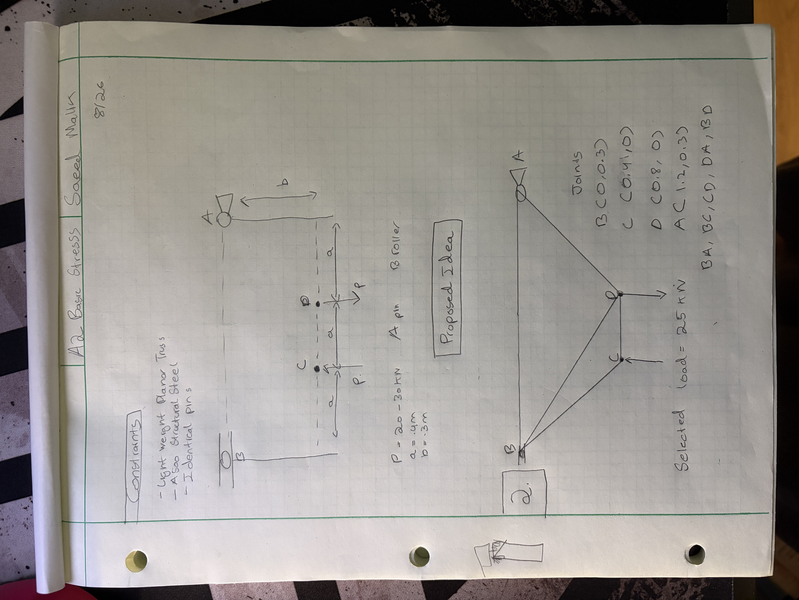
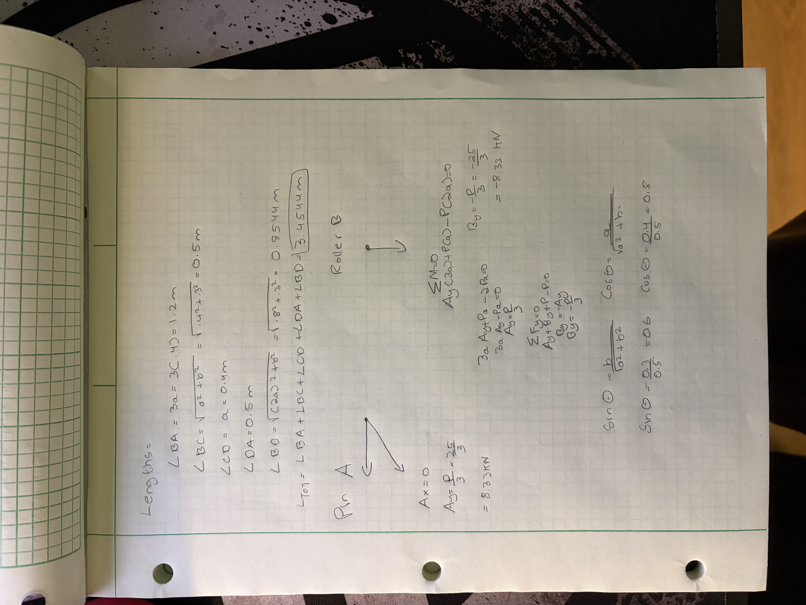
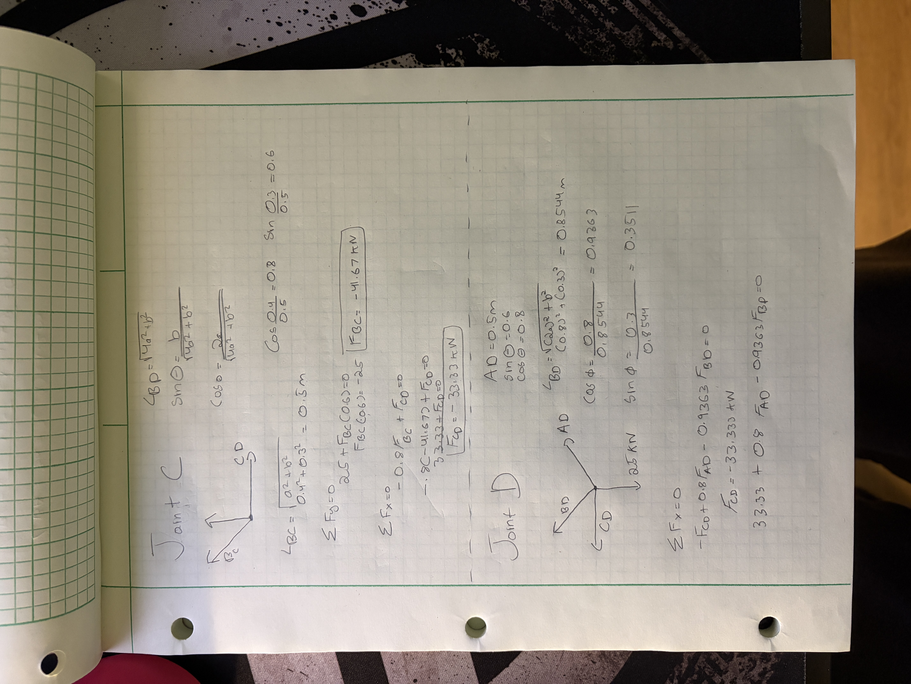
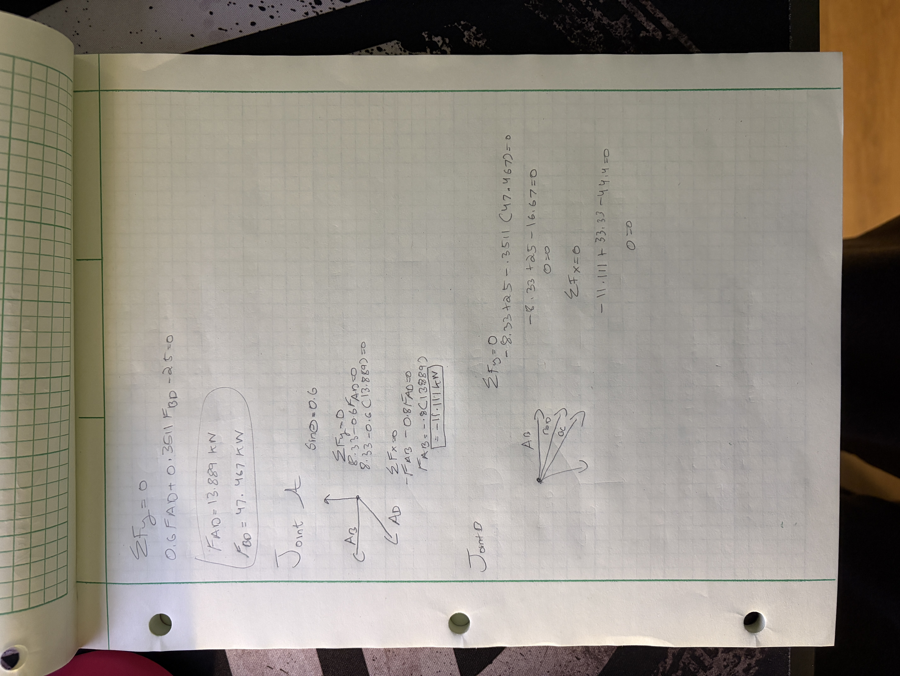
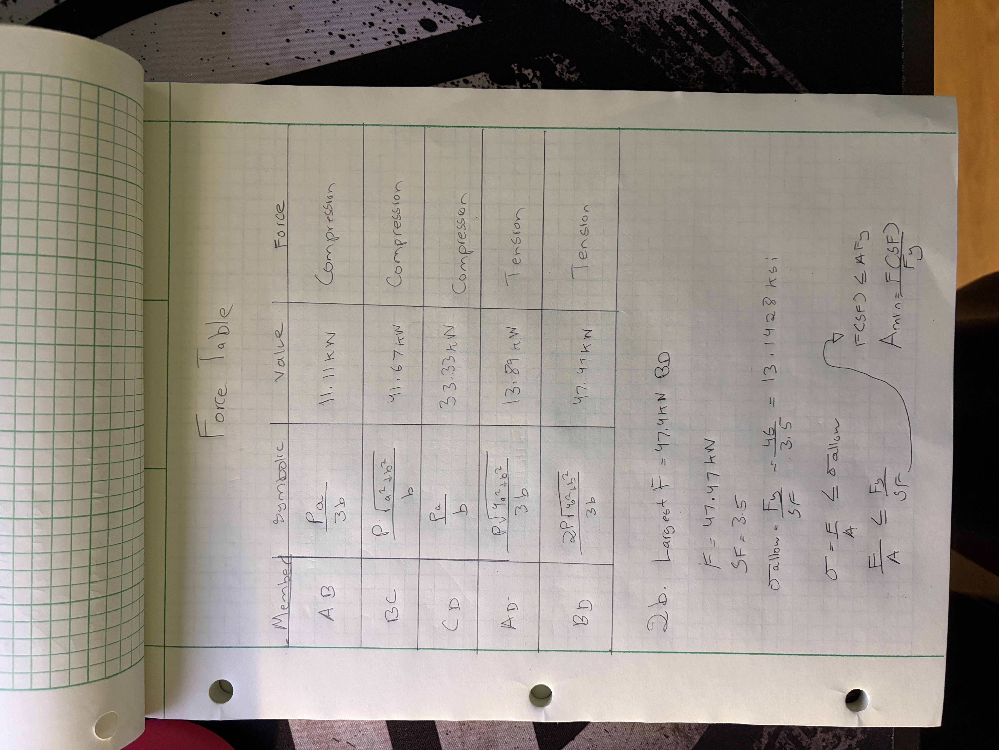
Above lies my internal forces table for my chosen beam, as you can see most of the forces are in compression with just a few being in tension. They all cancel out to make a static truss. The second half of this page pretends to our next category.

### Cross Sectional Area

In the bottom half of the previous picture and the one right below, I am calculating the cross sectional area along with the approximate weight of my truss. To symbolically calculate the area I had to first pick the highest internal force in my truss which was 47.47 kN in truss BD, then I combined some force formulas and found the minimum area to be 0.8119 in^2. The internal force and area value seemed a little high but they are correct as instead of splitting the load of beam C and D into 2 beams, I used 1 beam to be lighter, so the beam had to carry a larger force, hence a large area as well. Lastly, you can see that I calculated the weight of my truss, which I got by adding up the length of all my beams (3.4544 m), converting that to inches (136 in) and multiplying that by the area to get the volume of 110.428 in^3. Lastly I multiplied the volume by the A500 steel density of 0.283 lb/in^3 to get 31.251 lb for my truss weight. 

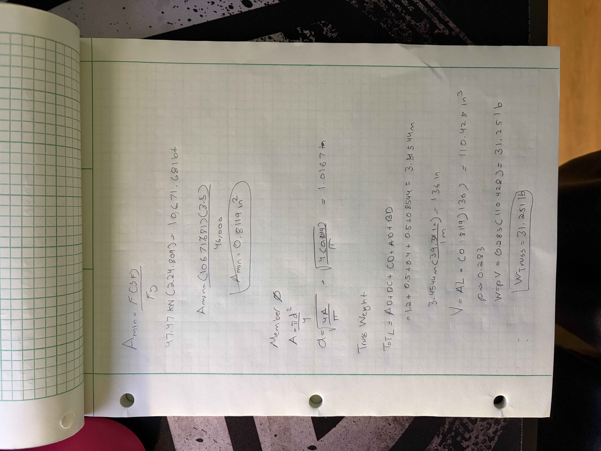

### Pin Cross Sectional Area

The page below contains my calculations of the required cross sectional area of pins to withstand the expected shear forces. For this asignment I was given the following values to use 
- yeild shear strength 170 ksi
- density 0.278 ib/in^3
- safety factor 4
- assume that elements that are in compression will not fail in buckling

After taking all of those values into account, I begun by generating another Free body diagram of my pin with the largest load, which after some thoughtful consideration came to be joint D. Initially I did one using Joint C, that page is not uploaded and after I realized that I was incorrect as that Joint contained the largest external force of 25 kN. For this section I needed the largest reaction load which was occurring at joint D due to the upward 25 kN force along with the beams BD and AD. I first numerically solved for the area formula and got the value 0.2511 in^2. Next up to calculate the pin weight I needed the pin diameter first, which came out to be 0.566 in, then by using the same process as for the truss weight, the pin weight came out to be 0.349 lb. 
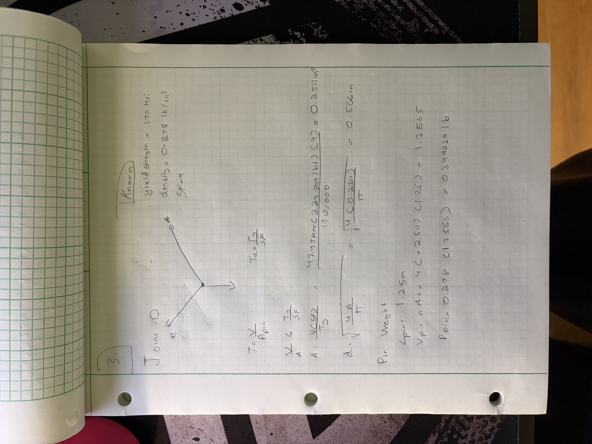

## Communicate
### CAD Process
For this section, I had to construct my beam design in a CAD software, I chose SolidWorks since I have a CSWA in SolidWorks although it has been over a year since I last modeled in SolidWorks. I had to model the pins as cylinders with the correct cross sectional area and lengths. The first page below is contains the required values that I needed for this process. First up is the value of the area of the bars which came out to be 23 mm x 23 mm. Next up is just the Pin Area and minimum diameter values repeated. Lastly I calculated the angles of the BC member which should be the same as DA at 36.87 degrees. The BD angle came out to be 20.56 degrees from CD. 

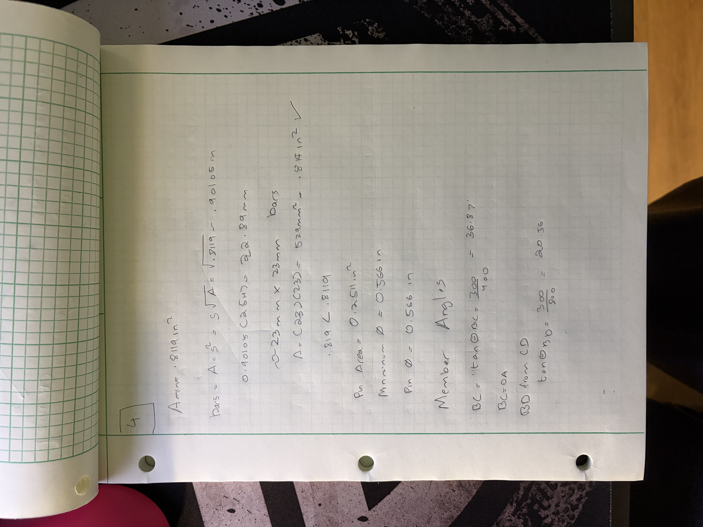

At first I drew the basic shape of the beam by using a midpoint line on the origin for the top BA beam which was 1200mm. Then I drew the the BC, CD, DA and BD beams in that respective order. I dimensioned the CD beam to 400 mm and set an equal constraint on the BC and DA beams and set them to 500 mm. Lastly I drew a beam from joint B to joint D and it was the right length and angle due to my previous dimensions. 

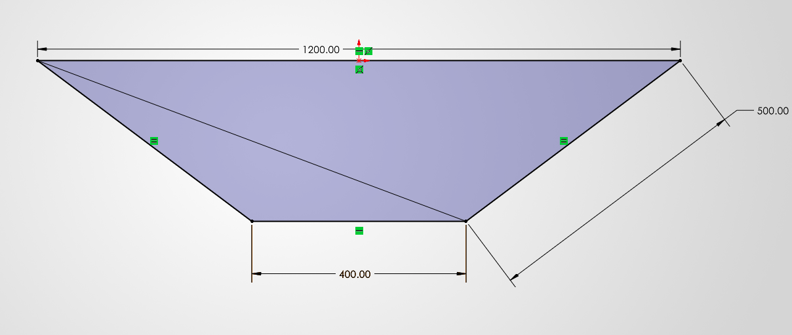

After drawing the beam, I used the Weldment feature to extrude my beam. After clicking Weldment, then Square Tube a menu pops up on the left hand side of the screen. In the menu I selected ISO, square tube, 20 x 20 x 2 size beams. My beam is a 23 x 23 and they did not have that specific size, the next one up was 30 x 30 x 2, this was still the most accurate way of design my beams that I was aware of, so I chose to continue this way, knowing that my final values will not be accurate as the beam is not the right size but it is the closest I could get it. After keeping that in mind, I added the extrusion to the beams, first on the outer beams and then sepratley on the one inside beam.

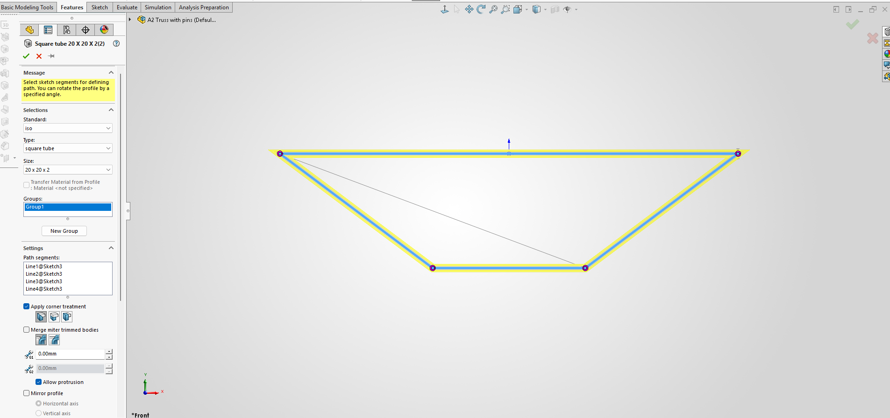
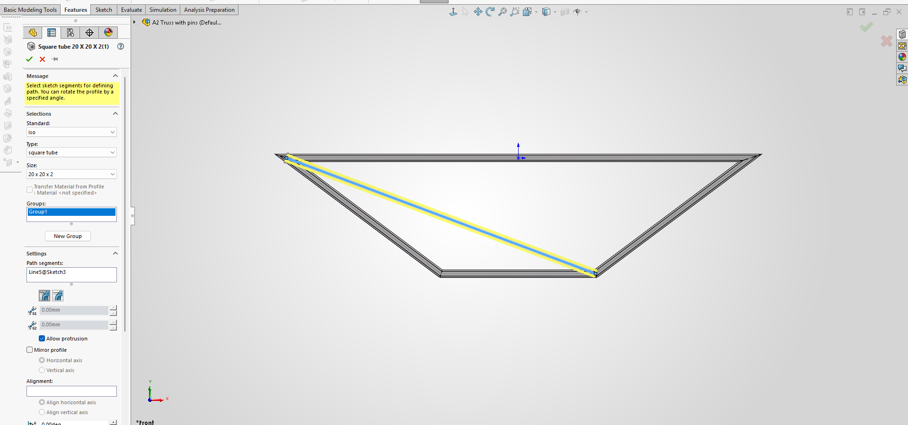

After making them into beams, I had some overlap issues with the BD beam clipping into other beams. So I used the trimextender feature to discard parts of the beam.

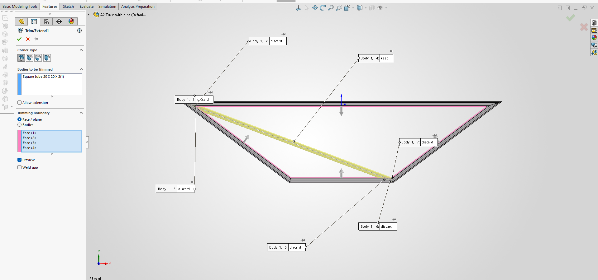

This is the beam without the pin holes.

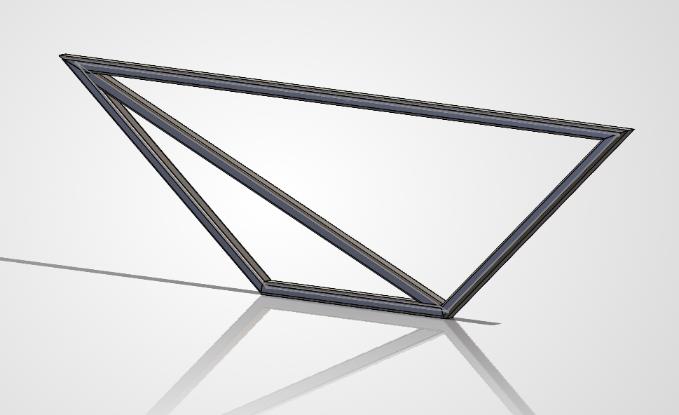

I added the pin holes

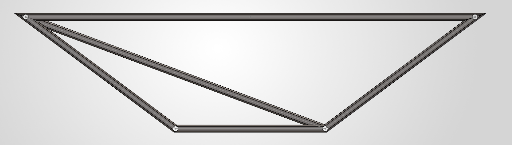

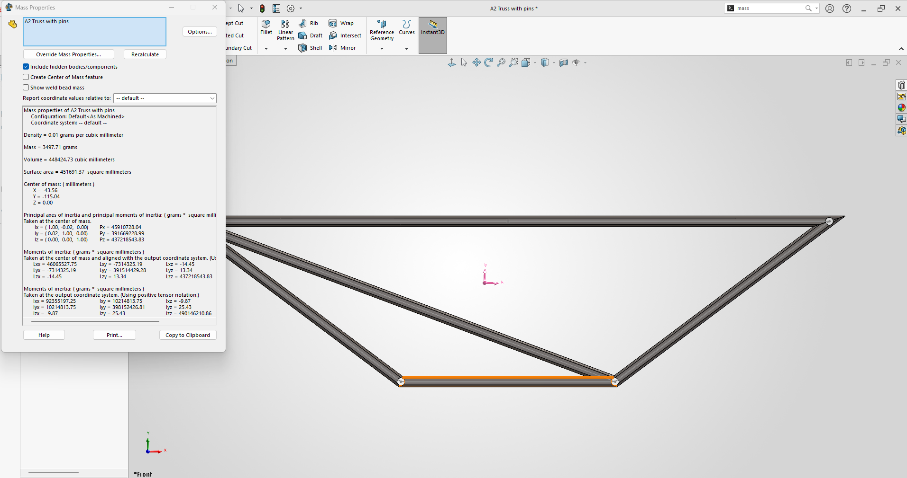

-<a href="./A2 Truss.SLDPRT" download>Truss CAD</a>

-<a href="./A2 Truss with pins.SLDPRT" download>Truss with Pins CAD</a>

