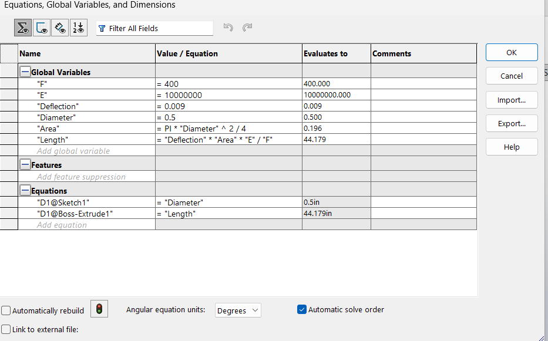
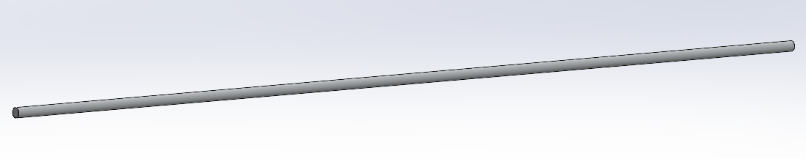

# A3 – [Parametric and FEA]

## Objective

- Use axial deflection modeling to design its dimensions
- Use parametric design to determine a bars length
- Introduce you to FEA (Finite Element Analysis)
- Introduce you to linking dimensions to appropriate parameters in CAD.
- Compare and contrast the different analysis

### Description:
To design a bar which has a circular cross section where the values of the criteria given for the material, maximum deflection, and load. Determine the bar’s minimum geometry (ie.. length, diameter, and weight) through parametric design while under direct tension. Then verify the geometry through finite element analysis.

## Analyze
### Parametric Design

The first step in designing a bar was to pick between the direct applied loads of 300 lbf < F < 500 lbf. The other given choice was to pick between 8.5 to 11.5 x10^6 psi for the Youngs Modulus for our Aluminum Bar. Below are the chose values for this specific bar along with some given values. After selecting the values, area and length calculations were done using direct tension elongation equations found in the Machinery's Handbook so that I could parametrically determine the length of the bar. The Area came out to be 0.19635 in^2 and the length was 44.18 in. 

Next up these values were entered in the variable section of the CAD Model. 
- F is the chose applied Force value
- E is the chosen Young's Modulus value

After inputting all the necessary values, I began to Generate the bar in CAD by using my variables and Parameters. First up was to draw a circle and assign it the diameter. 

After drawing the circle, I extruded it to the given length variable. 

Before I could progress any further and do the FEA analysis, I needed to add the Aluminum material to my bar. There were a lot of Aluminum options to pick from but none had the right parameters for the Youngs Modulus, so I created my own Aluminum. I copied the values of the one Aluminum with a very close Young's Modulus value and then edited the value in my Custom Materials to be the required 10,000,000psi.

## Decide
### FEA
Before I could conduct an FEA, I had to correctly apply the fixed load to one end of the bar and a pulling force of 400 N to the other end of the bar. 

#### Deflection Map

#### von Misses Stress Map

#### Max Stress Check 

## Communicate

