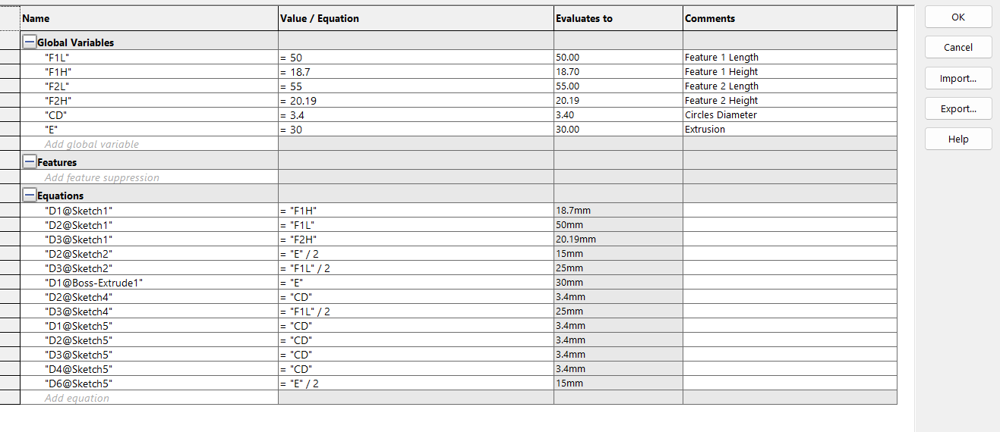
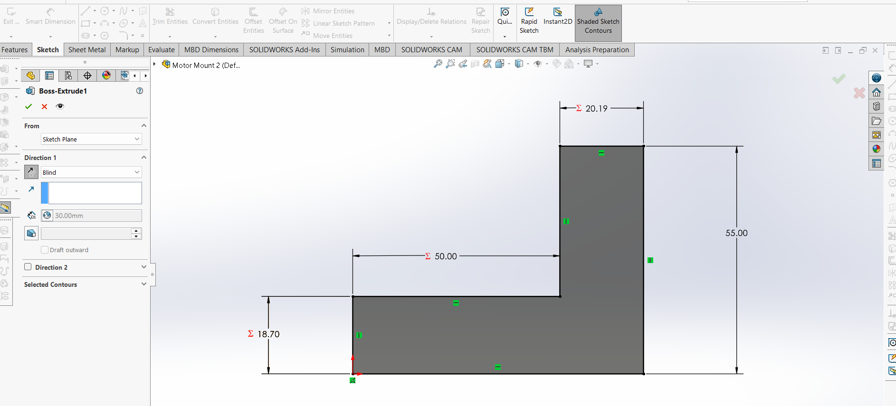
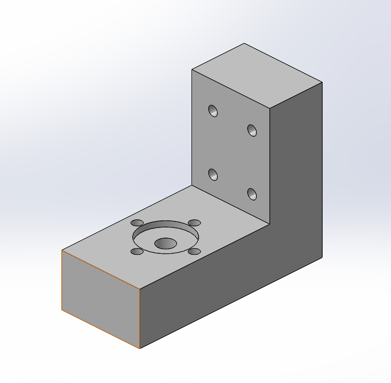

# A4 – [Motor Mount]

## Objective
Design a motor mount using the (Brushed 24V DC Gear Motor 3.6Kg.cm/46RPM w/ 99.5:1 Planetary Gearbox)<a href="https://www.omc-stepperonline.com/brushed-24v-dc-gear-motor-3-6kg-cm-46rpm-w-99-5-1-planetary-gearbox-pa28-28245800-g100">Here</a>
 which attaches to the rigid wall A. For both features, first design for yield strength and then design for a maximum deflection of .30 mm at the free end. You may select [ABS](https://www.specialchem.com/plastics/guide/acrylonitrile-butadiene-styrene-abs-plastic), PETG,  or <a href="https://www.matweb.com/search/DataSheet.aspx?MatGUID=ab96a4c0655c4018a8785ac4031b9278&ckck=1">PLA</a> as a motor mount material.  When designing the motor mount take into account a safety factor of 3 and neglect the weight of the motor. For steps 1 and 2 draw a FBD of the forces and a concept of your design. Research the design of different motor mounts and place the links in an appendix on your page. Make justifiable approximations in your design to simplify your analysis. (ie. use the beam calculations) Follow Appendix B for the initial approach to set up the design analysis.

Figure 1: Shows motor, the rigid wall and the force received on the shaft of the motor, where P = 300 N

## Analyze

First up, I just gathered some known information given from the prompt. The following information was recorded;

- Motor Information and Torque
- Chosen Material of ABS with E = 1.99 GPa
- Safety Factor of 3
- P value of 300 N
- Max Stress allowed calculation of 14.93 MPA
- Total lenght of 54.6m
  
### Feature 1

For Feature 1, first up is the Free-Body-Diagram with the P included. Then it is a summary of all the known and unknown values gathered so far. Some of the known values were the force value, the length value, modulus of Elasticity and max deflection. 

On this page, first the moment value was calculated. Next up using the derived max stress equation done in class, the numeric equation was modeled. Next up the numeric height equation was modeled. After both of the equations were modeled, the numerically value was found by plugging in the numbers. The stress came out to 11.1mm and the deflection height came out to be 18.7mm. 

A final calculation was done to check that the actual safety factor was greater than the ones of the given. This was done to make sure the deflection was below the given max deflection.

### Feature 2

For Feature 2, the specific feature 2 Free-Body-Diagram was drawn. Some of the known values were mentioned again like the Height, base and Moment. The Modulus of Elasticity, Force value and max deflection value were not mentioned again as they are assumed to be carried over to this feature as well. The unknown values are the height deflection and height stress. 

After both equations are modeled, I plugged the numbers in. The stress stayed the same as 11.1mm and deflection was 20.19mm.
## Decide
### Paper Sketch

### CAD Model

Before building the CAD Model, I added the following variables;

- Feature 1 Height
- Feature 1 Lenght
- Feature 2 Height
- Feature 2 Lenght
- Mini Circle Diameters
- Extrusion depth

This first image is just the creation of outline of the mount, this includes drawing feature 1 and feature 2 together as one part. Then extruding it to the variable value.

The next image is the creation of the hole to allow the mount to sit in. It is a 18 mm diameter hole matching with the machine size and it is placed in the middle of feature 1 length and extrusion values. The hole is extruded 2mm into the the top of feature 1.

After drawing a 22mm diameter construction hole, I drew one mini circle and used the circular sketch pattern to make the additional holes. Then I made the hole for the motor itself and extrude cut all the holes. 

Lastly I had to create the clearance holes for the shafts and bolts. The size of the holes was 3.4mm. I made one hole and use the horizontal and vertical constraints to line up the other holes. The dimensions in between the holes were calculated by dividing the extruded length in half. The holes were extruded all the way through.

Above is the image of the finished Model.
## Communicate
Below is the link for the CAD Model.
-<a href="./Motor Mount 2.SLDPRT" download>Motor Mount</a>

